Fitting of diffractive data.   
See:   
[H1 2006 fit](http://www-h1.desy.de/h1/www/publications/htmlsplit/DESY-06-049.long.poster.html)  
[QCDnum manual](https://www.nikhef.nl/~h24/qcdnum-files/doc/qcdnum170008.pdf)

# Plan
* Crosscheck the 2006 DPDF (i.e. in NLO FFNS)
* Repeat the fit to inclusive data with VFNS (NLO)
* Repeat the fit to inclusive data with VFNS (NNLO)
* Include jet data to the fit
* Do combined fit at NLO vs at NNLO (chi2 difference?)

# Crosscheck of the 2006 DPDF dit

## The check of the chi2 with published F2, FL
Agrees within 1 unit of chi2  
chi2 /ndf = 157.043 / 184 = 0.853497 (fit A) : org val 158.0154  
chi2 /ndf = 163.366 / 184 = 0.887861 (fit B) : org val 164.5480   
The small difference can be caused by rounding errors of the provided published values from the text file.
Or some uncertainty is slightly different.

## Check of the evolution
Evolution checked against QCDNUM.   
Notice the poor z-grid interpolation at the high-z in the original H1 2006 fits.
The input parametrisation must include steps (i.e. not the analytical formula) to get the evolution consistent.

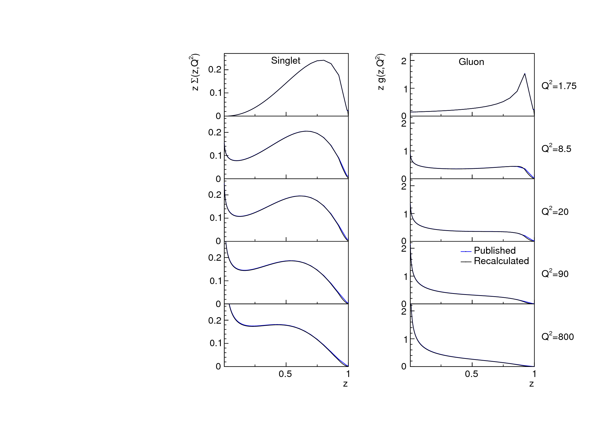
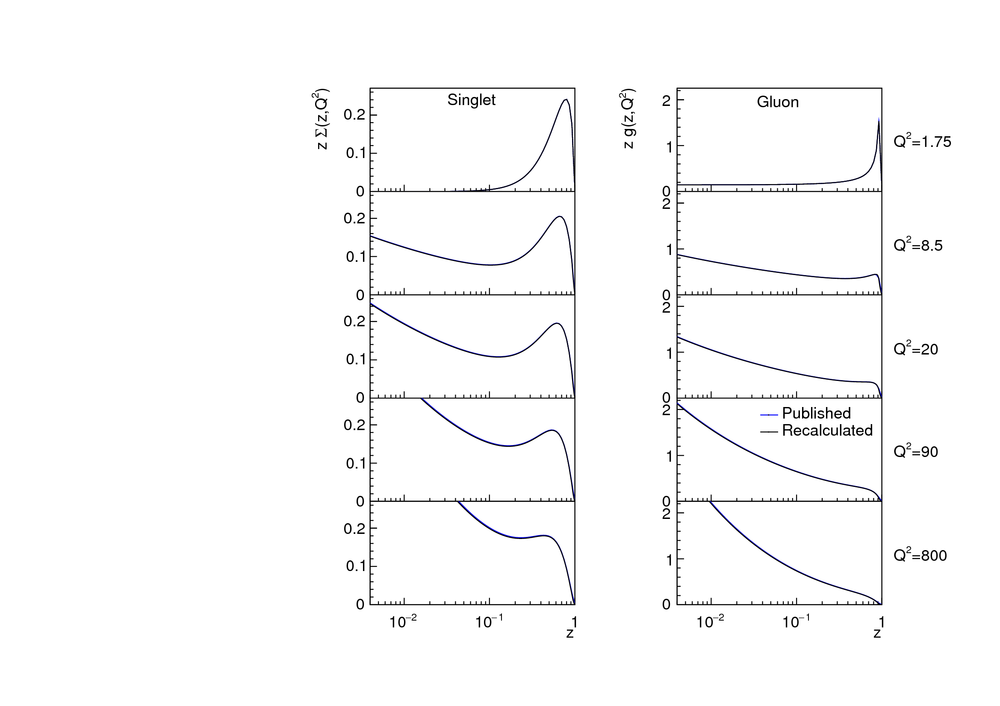

## Check of the convolution
Convolution checked using QCDNUM ZMSTF and HQSTF packages.  
The difference observed in F2c and F2l at the higher scales, why?

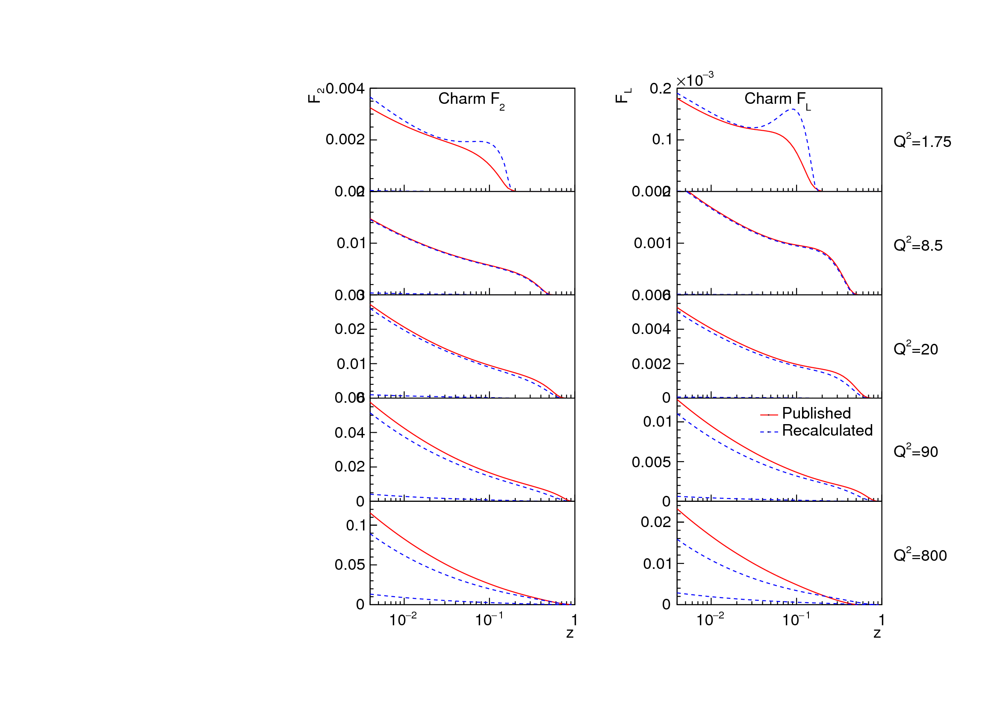
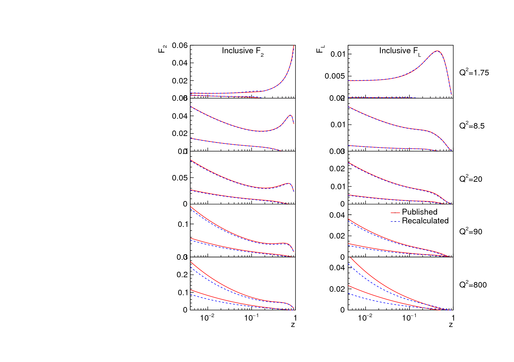

## Check of the reduced x-sections
Some deviations visible at the high-q2 region, related to the difference in the charm distribution.  
The floowing plots are in the style of H1 2006 paper.
Blue curve is the published one, whereas the green curve is obtained using software in this repository.
The initial PDF parametrisation is taken from the paper.  

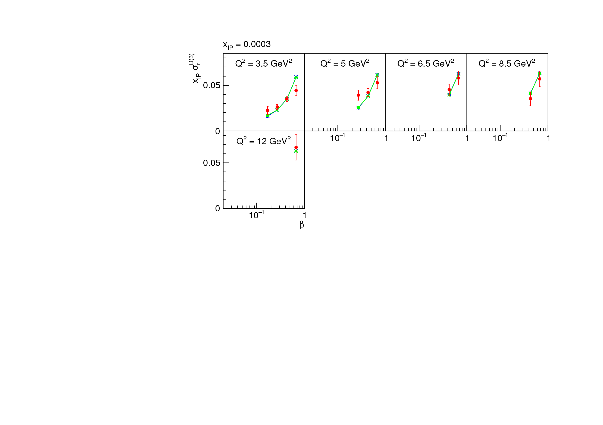
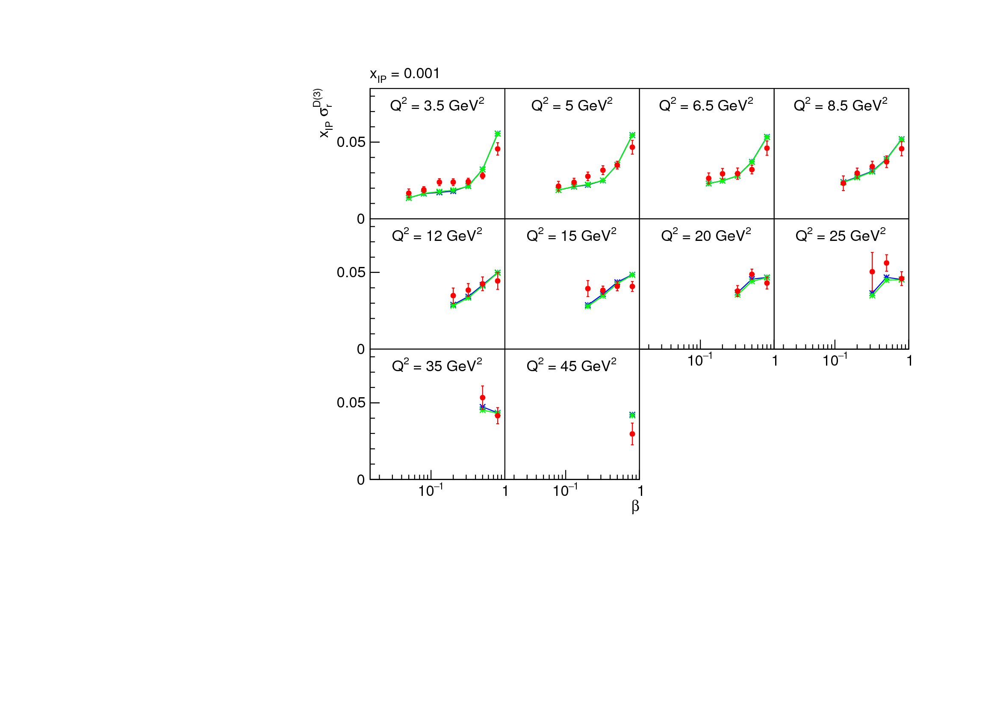
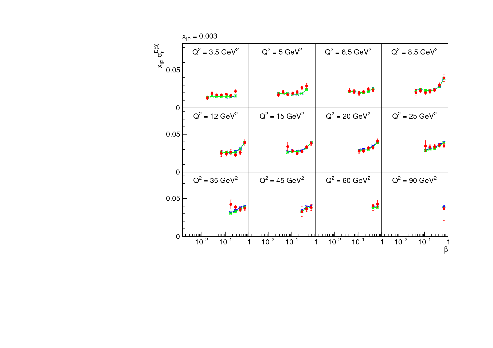
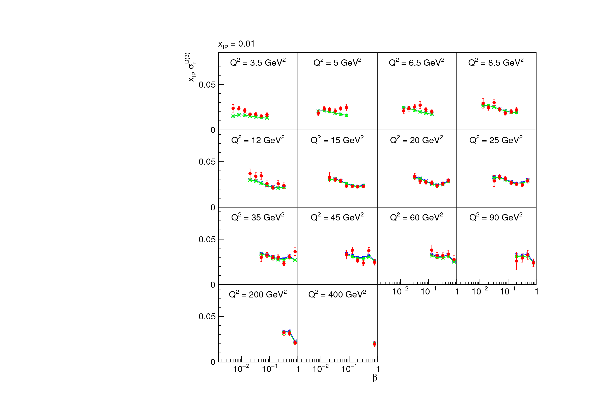
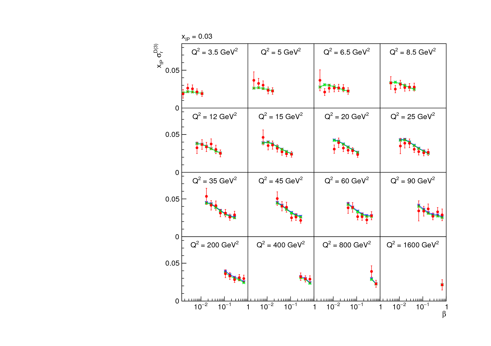

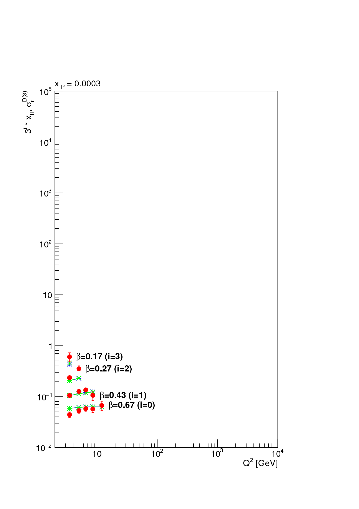
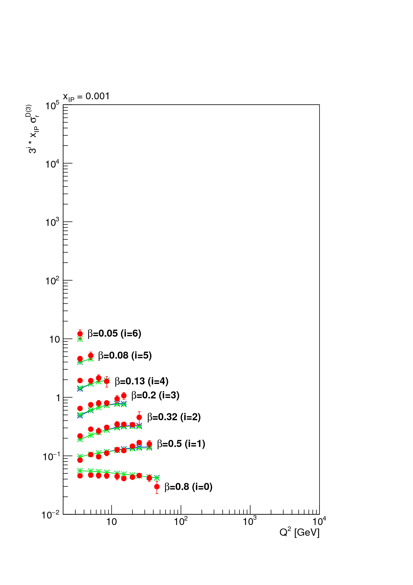
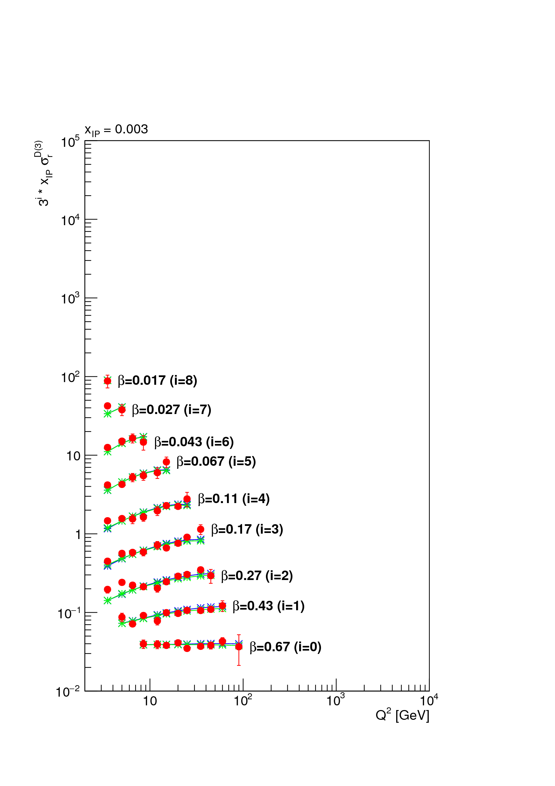
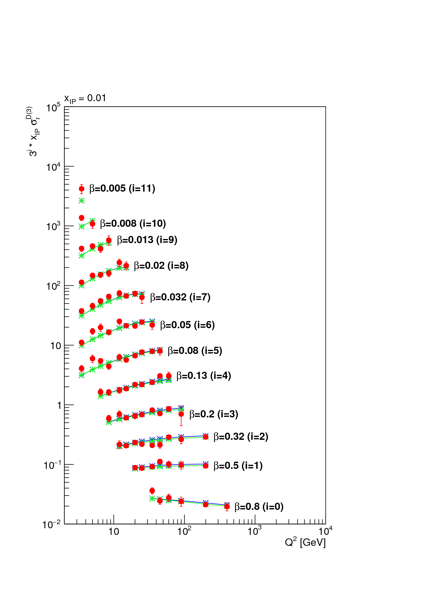
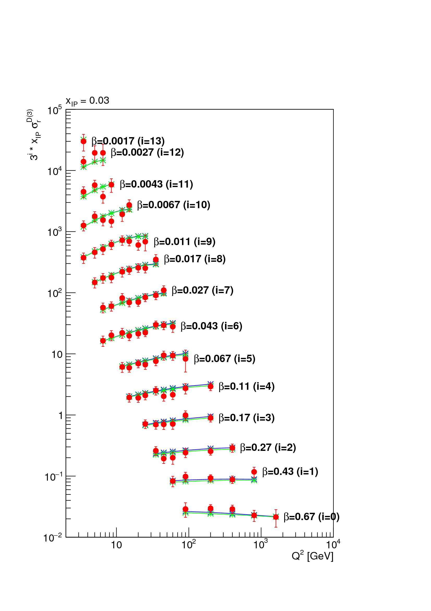
